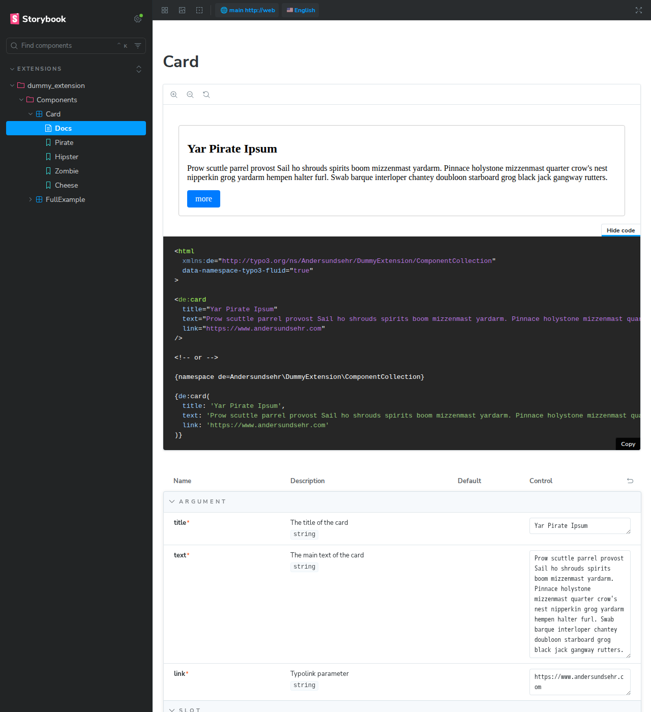
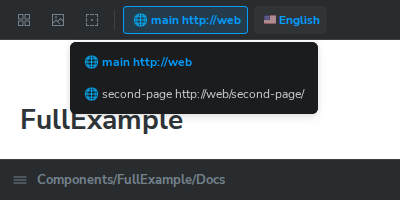
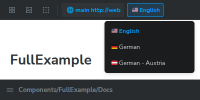

# `EXT:storybook`
 &nbsp;&nbsp;&nbsp;&nbsp;
  &nbsp;&nbsp;&nbsp;&nbsp;
  

[Getting Started](https://docs.typo3.org/permalink/andersundsehr-storybook:start)

The TYPO3 extension `storybook` integrates Storybook into TYPO3 projects.  
With the open-source tool Storybook, developers can develop and test UI components in isolation.  
It provides an environment where components can be visually displayed and interactively tested.  
The extension facilitates the development of TYPO3 frontend components by enabling seamless integration of Storybook into TYPO3.  

### Features:

- render [TYPO3 Fluid components](https://docs.typo3.org/permalink/fluid:components) in Storybook
- configure stories inside storybook with the standard [Storybook's CSF format](https://storybook.js.org/docs/api/csf)
- **automatically generates controls** for your components [arguments](https://docs.typo3.org/permalink/t3viewhelper:typo3fluid-fluid-argument) and [slots](https://docs.typo3.org/permalink/t3viewhelper:typo3fluid-fluid-slot)
- **Interactivity** via [Storybook's Controls](https://storybook.js.org/docs/essentials/controls), allowing you to change component properties in real-time
- shows [Fluid **code snippets**](https://storybook.js.org/docs/writing-docs/code-panel) for each component, allowing you to copy the code directly from Storybook
- wide range of [Storybook's addons](https://storybook.js.org/addons) are available to enhance the development experience, such as accessibility checks, design systems, and more

## Installation: How to install the extension? (Composer, manual, dependencies)

The extension can be installed via Composer:
```bash
composer require andersundsehr/storybook --dev
```

it is recommended to install storybook into your projects package.json file as well:
```bash
# !!! make sure to install the same version as the extension !!!
npm install @andersundsehr/storybook-typo3 --save-dev
# or
yarn add @andersundsehr/storybook-typo3 --dev
```

set framework in your `.storybook/main.ts` file to `@andersundsehr/storybook-typo3` as shown below.

After that you can run storybook with:
```bash
# run in dev mode:
./node_modules/.bin/storybook dev -p 6006
# or build it for production:
./node_modules/.bin/storybook build
# preview the production build:
npx http-server ./storybook-static
```

> Also See [full installation steps](https://docs.typo3.org/permalink/andersundsehr-storybook:installation) in the Getting Started Guide.

## Configuration:

### Inside TYPO3:
To be able to render your own Fluid components in Storybook,  
you need to configure your own [ComponentCollection](https://docs.typo3.org/permalink/fluid:components)  
and register the global fluid namespace in your `ext_localconf.php` file:

```php
$GLOBALS['TYPO3_CONF_VARS']['SYS']['fluid']['namespaces']['my'] = Vendor\MyExtension\ComponentCollection::class;
```

### Inside Storybook:
You need your own `.storybook/main.ts` file in your project, which should look like this:

```typescript
import type { StorybookConfig } from '@andersundsehr/storybook-typo3';

const config: StorybookConfig = {
  framework: '@andersundsehr/storybook-typo3', // required

  stories: [
    "../src/**/*.mdx",
    '../src/**/*.stories.@(js|jsx|mjs|ts|tsx)',
  ],

  core: {
    disableTelemetry: true,
  },

  env: (envs) => ({
    STORYBOOK_TYPO3_ENDPOINT: 'http://localhost/_storybook/', // env can be set here or in the .env file
    ...envs, // envs given to storybook have precedence
  }),
};
export default config;

```

## Usage: How to use the extension? (Examples, screenshots, typical use cases)

With a story file like this:
````typescript
import { type Meta, type StoryObj, fetchComponent } from '@andersundsehr/storybook-typo3';

export default {
  component: await fetchComponent('de:card'),
} satisfies Meta;

export const Pirate: StoryObj = {
  args: {
    title: 'Yar Pirate Ipsum',
    text: "Prow scuttle parrel provost Sail ho shrouds spirits boom mizzenmast yardarm. Pinnace holystone mizzenmast quarter crow's nest nipperkin grog yardarm hempen halter furl. Swab barque interloper chantey doubloon starboard grog black jack gangway rutters.",
    link: 'https://www.andersundsehr.com',
  },
};
````

and a Fluid component like this:
```html
<f:argument name="title" type="string" description="The title of the card" />
<f:argument name="text" type="string" description="The main text of the card" />
<f:argument name="link" type="string" description="Typolink parameter" />

<a href="{f:uri.typolink(parameter: link)}" class="card">
  <h1 class="card__title">{title}</h1>
  <p class="card__text">{text}</p>
  <span class="card__moreButton">more</span>
</a>

<f:asset.css identifier="de:card">
  .card {
  display: block;
  padding: 1rem;
  border: 1px solid #ccc;
  border-radius: 4px;
  text-decoration: none;
  color: inherit;
  }
  .card__title {
  font-size: 1.5rem;
  margin-bottom: 0.5rem;
  }
  .card__text {
  font-size: 1rem;
  margin-bottom: 1rem;
  }
  .card__moreButton {
  display: inline-block;
  padding: 0.5rem 1rem;
  background-color: #007bff;
  color: white;
  border-radius: 4px;
  text-decoration: none;
  }
</f:asset.css>
```

you get a Storybook interface that allows you to interactively test your component, like this:


You can Select the site and the language in the top right corner of the Storybook interface:  



## Documentation: Where to find more information? (Links, references, tutorials)

https://docs.typo3.org/permalink/andersundsehr-storybook:start

- docs TODO link to hosted Storybook instance
- docs TODO link to playwright report?

## Development: Notes for developers (e.g., code structure, important classes, extensibility)

The Storybook framework is located in the `the-npm-package` folder inside the extension.  
It provides a custom framework for Storybook, which allows you to render TYPO3 Fluid components in Storybook.  
It is implemented in TypeScript and is designed to be used with Storybook's Component Story Format (CSF).  

The TYPO3 extension `storybook` uses a [Middleware](./Classes/Middleware/StorybookMiddleware.php) to handle requests to the Storybook endpoint.
It has [Actions](./Classes/Action/) to give Storybook the necessary information.
It renders the Fluid components using the corresponding ComponentCollection that must be registered in TYPO3  
via `$GLOBALS['TYPO3_CONF_VARS']['SYS']['fluid']['namespaces']`.

### Development helpers:
the test setup is a nice location to get started with developing the extension.
it also has a [dummy project](./.Build/dummy-project/) that can be used to test the extension in a real TYPO3 environment.

## Tests: How to run tests? Are there test data?

Currently there are only integration tests with [Playwright](./.Build/dummy-project/tests/)
to run the tests you can use the following command:
```bash
cd .Build/
bash test.sh executeAll
```

If you want to make changes to the extension, and than run the tests again you should do this:
```bash
cd .Build/
bash test.sh composerInstall
bash test.sh storybookBuild
bash test.sh watchMode
# in different terminal:
cd .Build/
bash test.sh playwright:ui # (X11 forwarding required)
```

## Troubleshooting: Known issues, troubleshooting, FAQ

## Changelog: Important changes and versions

until now there are no breaking changes, but the extension is still in development.

## License and Authors: License type, contributors, contact information

This extension is licensed under the [GPL-2.0-or-later](https://spdx.org/licenses/GPL-2.0-or-later.html) license.

# with ♥️ from anders und sehr GmbH

> If something did not work 😮  
> or you appreciate this Extension 🥰 let us know.

> We are always looking for great people to join our team!
> https://www.andersundsehr.com/karriere/
